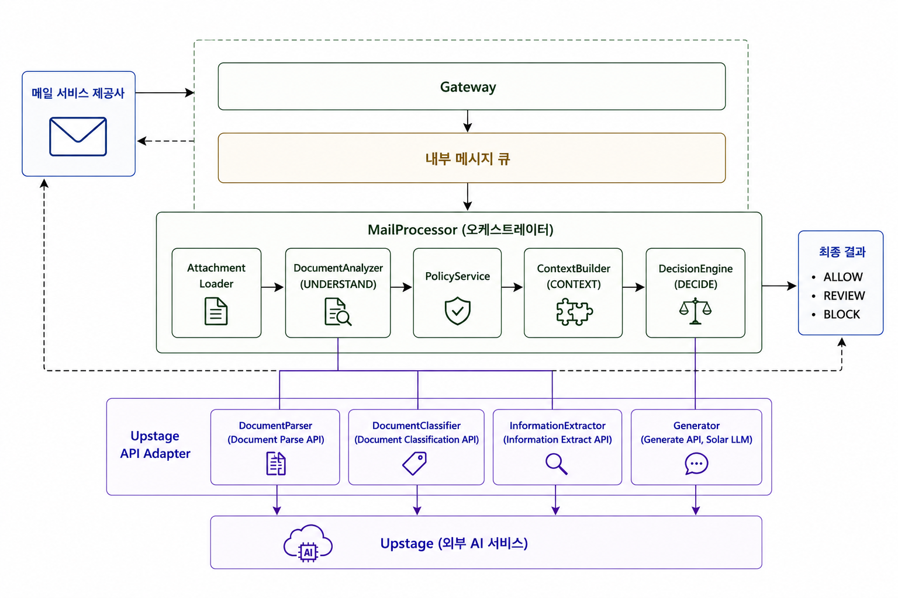
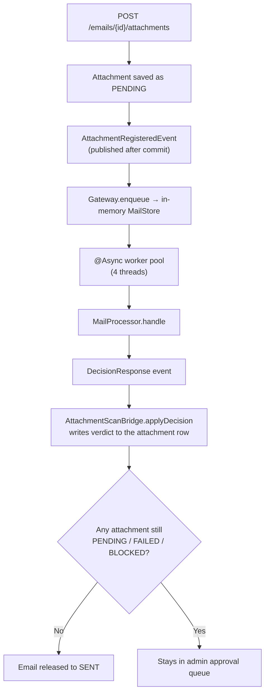
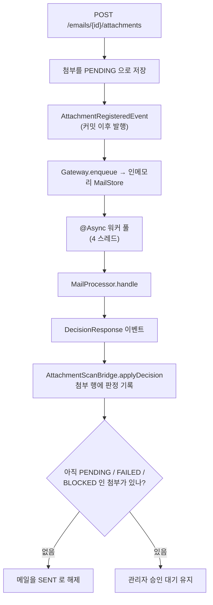

<h1 align="center">ShhDoc API (쉿독 백엔드)</h1>

<p align="center">
  <b>The engine that reads what's <i>inside</i> the attachment before it leaves the building.</b><br/>
  Filename filters are bypassed by a rename. Content isn't.
</p>

<p align="center">
  
  
  
  
  
  
  
  
</p>

<p align="center">
  <a href="#english">🇺🇸 English</a> ·
  <a href="#한국어">🇰🇷 한국어</a>
</p>

---

# English

## Overview

**ShhDoc API** is the backend of the ShhDoc Data Loss Prevention mail platform. It answers one question, every time somebody hits Send:

> *Is it safe for this document to go to these recipients?*

Extension- and filename-based filters lose the moment a user renames `payroll.xlsx` to `notes.txt`. This service instead pulls the attachment out of object storage, **runs the actual bytes through Upstage's document AI**, derives a document type, a set of sensitive-information types, and a security classification — then matches all of that against the company's own export rules and the recipient's category.

The result is one of **ALLOW / REVIEW / BLOCK**. Anything that isn't a clean ALLOW is routed to an admin for approval instead of going out.

The frontend lives in a separate repository: **[shhdoc-web](https://github.com/daese-junction/shhdoc-web)**.

## Architecture

<p align="center">
  
</p>

The analysis module is deliberately isolated behind a `Gateway` interface. Nothing in the mail or attachment domain calls Upstage directly — `AttachmentScanBridge` is the single crossing point, in both directions.

**Why a queue?** Analysis takes 10–40 seconds per document. Holding the HTTP request open for that long would time out the browser and pin a Tomcat thread. Instead the request returns immediately with `PENDING`, and the verdict arrives asynchronously.



### The five pipeline stages

`MailProcessor` orchestrates the whole thing. Policy, company vocabulary and recipient type are resolved **once per mail** and reused across every attachment.

| Stage | Class | What it does |
| --- | --- | --- |
| 1. Load | `AttachmentLoader` | Pulls the file out of MinIO by storage key |
| 2. Understand | `DocumentAnalyzer` | Fans out to three Upstage APIs **in parallel** (`CompletableFuture.allOf`) — parse, classify, extract |
| 3. Policy | `PolicyService` | Loads the company's enabled rules and flattens them into a matchable form |
| 4. Context | `ContextBuilder` | Resolves the recipient category and assembles everything into one `MailContext` |
| 5. Decide | `DecisionEngine` | First matching rule wins; `Generator` (Solar LLM) writes the human-readable reason |

### Upstage API adapter

| Adapter | Upstage API | Purpose |
| --- | --- | --- |
| `DocumentParser` | Document Parse | Extract text and layout from PDF/image/office files |
| `DocumentClassifier` | Document Classification | Map the document to one of the company's document types |
| `InformationExtractor` | Information Extraction | Detect the company's registered sensitive-information types and the security classification |
| `Generator` | Chat Completions (Solar LLM) | Turn the verdict into a sentence a human can act on |

> **Rate limiting.** Upstage's synchronous endpoints run at RPS = 1. Each adapter guards itself with its own `Semaphore(1)` rather than relying on the worker pool size — the pool controls how many *mails* run at once, not how many API calls do.

## The rule engine

Every company defines its own rules. A rule ANDs together up to five conditions, and any condition left empty means *don't care*:

```
direction (ALL / INTERNAL / OUTBOUND)
  × document category
  × document type
  × sensitive-information type
  × security classification
  × recipient scope
  → ALLOW | REVIEW | BLOCK
```

Two conditions can mean "any of these", which a single rule can't express — so `PolicyServiceImpl` fans one stored rule out into the cartesian product of:

- a **category** with no specific document type → every document type under that category
- **OUTBOUND** with no specific recipient scope → `partner`, `personal_email`, `external`

### Recipient classification

Recipients are graded on a four-level scale whose declaration order *is* the risk order:

```
INTERNAL  <  PARTNER  <  PERSONAL_EMAIL  <  EXTERNAL
```

`INTERNAL` is derived from the company's registered `emailDomain`. `PARTNER` and `PERSONAL_EMAIL` come from domains the company registers itself. Anything unregistered falls through to `EXTERNAL`.

When a mail has several recipients, **the riskiest one represents the mail** — three colleagues plus one Gmail address is a `personal_email` send.

### Default verdict

If no rule matches, the verdict is **ALLOW**. The policy model lists what to *restrict*, so "nothing matched" means "nothing restricted". Approval is triggered by the attachment verdict, not by the recipient — an external send with a clean attachment goes straight out, while payroll to a personal address is held whether the sender is internal or not.

## Mail lifecycle

```
DRAFT ──send()──┬─→ SENT       every attachment ALLOWED
                └─→ BLOCKED    any attachment BLOCKED or FAILED
                                    │
                        admin approve ─→ SENT
                        admin reject  ─→ REJECTED
```

`DRAFT` is the only state in which a mail can be edited, deleted or sent. Once it leaves `DRAFT` the sender can no longer change it — otherwise an admin could approve one thing and a different thing could go out.

A scan result that lands late re-evaluates the mail and releases it if the last reason to hold it is gone. Only `BLOCKED` is released: `DRAFT` hasn't been sent yet, and `REJECTED` was an explicit human decision.

### Scan states

| `ScanStatus` | Meaning |
| --- | --- |
| `PENDING` | Queued or in flight. The mail cannot be sent yet |
| `DONE` | Analyzed. Carries a `Verdict` of `ALLOWED` or `BLOCKED` |
| `FAILED` | **Could not be analyzed.** Distinct from `BLOCKED` on purpose — `BLOCKED` means "we looked and a human should decide", `FAILED` means "we never saw it". Its verdict is left null, and it holds the mail |

## API

| Method | Path | Description |
| --- | --- | --- |
| `POST` | `/companies` | Create a company (also creates the first admin) |
| `GET` | `/companies/me` | My company |
| `GET` `POST` | `/companies/members` | List / add members (add is admin-only) |
| `POST` | `/auth/login` `/auth/refresh` `/auth/logout` | JWT session |
| `GET` | `/auth/me` | Current principal |
| `POST` `GET` | `/emails` | Create draft / list mine |
| `GET` `PATCH` `DELETE` | `/emails/{id}` | Read / edit / delete a draft |
| `POST` | `/emails/{id}/send` | Send — resolves to `SENT` or `BLOCKED` |
| `POST` | `/emails/{emailId}/attachments/upload-url` | Issue a presigned upload URL |
| `POST` `GET` | `/emails/{emailId}/attachments` | Register after upload / list |
| `GET` | `/attachments/{id}/download-url` | Presigned download (sender or admin) |
| `POST` | `/attachments/{id}/rescan` | Re-run analysis |
| `DELETE` | `/attachments/{id}` | Remove an attachment |
| `GET` | `/admin/emails` | Approval queue |
| `POST` | `/admin/emails/{id}/approve` `/reject` | Admin decision |
| `GET` `POST` `PUT` `DELETE` | `/admin/policy/rules` | Export rules (plus `PATCH /{id}/enabled` to toggle one) |
| `GET` `POST` `PUT` `DELETE` | `/admin/policy/categories` `/document-types` | Document taxonomy |
| `GET` `POST` `PUT` `DELETE` | `/admin/policy/sensitive-types` | Sensitive-information types |
| `GET` `POST` `PUT` `DELETE` | `/admin/policy/domains` | Partner / personal-email domains |

Interactive docs are served by SpringDoc at `/swagger-ui.html`.

### Attachment upload is a three-step flow

Files never pass through the application. The browser uploads straight to object storage with a presigned URL, which keeps large attachments off the app's heap and out of nginx's request body limit.

```
1. POST .../attachments/upload-url   → { storageKey, uploadUrl }
2. PUT  <uploadUrl>                  → browser → MinIO, direct
3. POST .../attachments              → server verifies the object exists,
                                       hashes it, and queues the scan
```

## Tech stack

| Layer | Technology |
| --- | --- |
| Language / runtime | Java 21 (virtual-thread-ready toolchain) |
| Framework | Spring Boot 4.1, Spring Web MVC, Spring Security |
| Persistence | Spring Data JPA, Hibernate 7, MySQL 8.4 |
| Object storage | MinIO (S3-compatible) via AWS SDK v2, presigned PUT/GET |
| Auth | JWT (jjwt) — 30-minute access token, 7-day refresh token |
| AI | Upstage Document Parse / Classification / Information Extraction / Solar LLM |
| API docs | SpringDoc OpenAPI 3 |
| Testing | JUnit 5, Mockito, Testcontainers (MySQL) |
| Build / deploy | Gradle 9.5, Docker Compose, nginx, GitHub Actions |

## Getting started

Requires **JDK 21** and **Docker**.

```bash
# MySQL and MinIO start automatically via spring-boot-docker-compose
./gradlew bootRun
```

The app comes up on `http://localhost:8080`. Without `UPSTAGE_API_KEY` the pipeline still runs but every analysis fails, so attachments land in `FAILED`.

```bash
export UPSTAGE_API_KEY=up_...
./gradlew bootRun
```

### Tests

```bash
./gradlew test          # unit + integration (Testcontainers needs Docker running)
./gradlew build         # the same gate CI runs
```

Integration tests spin up a real MySQL through Testcontainers, so a working Docker socket is required. The four `*IntegrationTest` classes under `pipeline/` call the live Upstage API and are skipped without a key.

### Configuration

| Variable | Default | Notes |
| --- | --- | --- |
| `UPSTAGE_API_KEY` | *(empty)* | Required for real analysis |
| `JWT_SECRET` | dev value | **Must** be overridden in production — HS256, 32+ bytes |
| `STORAGE_ENDPOINT` | `http://localhost:9000` | Where the app reaches MinIO |
| `STORAGE_PUBLIC_ENDPOINT` | `http://localhost:9000` | Host baked into presigned URLs — must be browser-reachable, or signatures won't match |
| `CORS_ALLOWED_ORIGINS` | deployed + localhost | Exact string match, no trailing slash |

## CI/CD

- **CI** (`ci.yml`) — every push to a non-`main` branch and every PR into `main` runs `./gradlew build`: compile, unit tests, and Testcontainers integration tests. This gate has to pass before merge.
- **Deploy** (`deploy.yml`) — a push to `main` builds the jar **on the GitHub runner**, `scp`s it to the server, and restarts the Compose stack. The server is 2 vCPU; building there took 161s versus 4s for a copy. Running the build on `main` is also what keeps the Gradle dependency cache warm, since `setup-gradle` opens the cache read-only on non-default branches.
- Old images are pruned on every deploy — the server disk is 10GB and a dangling image per release fills it fast.

## Project structure

```
src/main/java/com/shhdoc/
├─ attachment/          # Attachment entity, upload/registration, scan bridge
│  ├─ AttachmentScanBridge   # the ONLY crossing point to the analysis module
│  └─ PendingScanRecovery    # re-queues PENDING attachments on boot
├─ email/               # Mail lifecycle, send gate, admin approval
├─ policy/              # Rules, categories, document types, sensitive types, domains
├─ company/ user/ auth/ # Organization and JWT authentication
├─ storage/             # MinIO / S3 presigning
├─ common/              # Error handling, trace-id filter, shared utils
└─ upstage/             # Analysis module — nothing outside calls this directly
   ├─ Gateway           # inbound boundary
   ├─ MailProcessor     # orchestrator
   ├─ document/         # parallel fan-out across the three APIs
   ├─ context/          # recipient classification
   ├─ decision/         # rule matching
   ├─ policy/           # DB policy → matchable rules
   └─ pipeline/         # Upstage adapters (parse, classify, extract, generate)
```

`docs/erd.dbml` holds the data model, viewable at [dbdiagram.io](https://dbdiagram.io). It currently covers the mail side only — the five policy tables (`policy_rules`, `document_categories`, `document_types`, `sensitive_info_types`, `recipient_domains`) are managed by JPA and not yet drawn.

## Team

**[daese-junction](https://github.com/daese-junction)** — hackathon team project.

This repository (`shhdoc-api`) is the backend and analysis engine. The frontend is [`shhdoc-web`](https://github.com/daese-junction/shhdoc-web).

<br/>

---

# 한국어

## 소개

**쉿독 API**는 쉿독 정보 유출 방지(DLP) 메일 플랫폼의 백엔드입니다. 누군가 발송 버튼을 누를 때마다 하나의 질문에 답합니다.

> *이 문서를 이 수신자들에게 보내도 되는가?*

확장자나 파일명 기반 필터는 `급여대장.xlsx`를 `메모.txt`로 바꾸는 순간 뚫립니다. 이 서비스는 대신 오브젝트 스토리지에서 첨부를 꺼내 **실제 바이트를 Upstage 문서 AI에 통과시켜** 문서 유형, 민감정보 유형, 보안 등급을 뽑아낸 뒤, 회사가 정의한 반출 규칙과 수신자 구분에 대조합니다.

결과는 **ALLOW / REVIEW / BLOCK** 중 하나입니다. 깨끗한 ALLOW가 아니면 그대로 나가지 않고 관리자 승인으로 넘어갑니다.

프론트엔드는 별도 저장소입니다: **[shhdoc-web](https://github.com/daese-junction/shhdoc-web)**

## 아키텍처

<p align="center">
  
</p>

분석 모듈은 `Gateway` 인터페이스 뒤로 격리돼 있습니다. 메일·첨부 도메인의 어떤 코드도 Upstage를 직접 부르지 않고, `AttachmentScanBridge` 한 곳만 양방향으로 지납니다.

**왜 큐를 두는가.** 문서 하나 분석에 10~40초가 걸립니다. 그동안 HTTP 요청을 붙잡고 있으면 브라우저가 타임아웃되고 톰캣 스레드도 묶입니다. 그래서 요청은 즉시 `PENDING`으로 응답하고, 판정은 비동기로 도착합니다.



### 파이프라인 5단계

`MailProcessor`가 전체를 오케스트레이션합니다. 정책·회사 어휘·수신자 유형은 **메일당 한 번만** 구해서 모든 첨부가 재사용합니다.

| 단계 | 클래스 | 하는 일 |
| --- | --- | --- |
| 1. 적재 | `AttachmentLoader` | storage key로 MinIO에서 파일을 꺼낸다 |
| 2. 이해 | `DocumentAnalyzer` | Upstage API 세 개를 **동시에** 호출 (`CompletableFuture.allOf`) — 파싱·분류·추출 |
| 3. 정책 | `PolicyService` | 회사의 활성 규칙을 읽어 매칭 가능한 형태로 펼친다 |
| 4. 문맥 | `ContextBuilder` | 수신자 구분을 판정하고 전부 하나의 `MailContext`로 조립 |
| 5. 판정 | `DecisionEngine` | 먼저 매칭된 규칙이 이긴다. 사유 문장은 `Generator`(Solar LLM)가 작성 |

### Upstage API 어댑터

| 어댑터 | Upstage API | 역할 |
| --- | --- | --- |
| `DocumentParser` | Document Parse | PDF·이미지·오피스 파일에서 텍스트와 레이아웃 추출 |
| `DocumentClassifier` | Document Classification | 회사가 등록한 문서 유형 중 하나로 분류 |
| `InformationExtractor` | Information Extraction | 회사가 등록한 민감정보 유형과 보안 등급 검출 |
| `Generator` | Chat Completions (Solar LLM) | 판정을 사람이 읽고 판단할 수 있는 문장으로 |

> **호출 제한.** Upstage 동기 엔드포인트는 RPS = 1입니다. 워커 풀 크기에 기대지 않고 각 어댑터가 자기 `Semaphore(1)`로 스스로를 막습니다 — 풀은 동시에 처리하는 *메일* 수를 제한하는 것이지 API 호출 수가 아닙니다.

## 규칙 엔진

회사마다 규칙을 직접 정의합니다. 규칙 하나는 조건 다섯 개를 AND로 묶고, 비워둔 조건은 *무관*으로 처리됩니다.

```
발송 방향 (ALL / INTERNAL / OUTBOUND)
  × 문서 대분류
  × 문서 유형
  × 민감정보 유형
  × 보안 등급
  × 수신 범위
  → ALLOW | REVIEW | BLOCK
```

두 조건은 "이 중 아무거나"를 뜻하는데 규칙 한 줄로는 표현할 수 없어, `PolicyServiceImpl`이 저장된 규칙 하나를 카티션 곱으로 펼칩니다.

- **대분류**만 있고 세부 문서 유형이 없으면 → 그 대분류에 속한 문서 유형 전부
- **OUTBOUND**인데 수신 범위가 없으면 → `partner`, `personal_email`, `external`

### 수신자 구분

수신자는 4단계로 나뉘며, **선언 순서 자체가 위험도 서열**입니다.

```
INTERNAL  <  PARTNER  <  PERSONAL_EMAIL  <  EXTERNAL
```

`INTERNAL`은 회사가 등록한 `emailDomain`에서 파생됩니다. `PARTNER`와 `PERSONAL_EMAIL`은 회사가 직접 등록한 도메인이고, 등록되지 않은 도메인은 전부 `EXTERNAL`로 떨어집니다.

수신자가 여러 명이면 **가장 위험한 한 명이 메일을 대표합니다** — 사내 동료 3명에 Gmail 주소 하나가 섞이면 그 메일은 `personal_email` 발송입니다.

### 기본 판정

매칭되는 규칙이 없으면 판정은 **ALLOW**입니다. 정책 모델이 *막을 것*을 나열하는 방식이라, "아무것도 안 걸렸다"는 곧 "제한 대상이 아니다"입니다. 승인 트리거는 수신자가 아니라 첨부 판정입니다 — 첨부가 깨끗하면 사외 발송도 그대로 나가고, 급여대장을 개인 메일로 보내면 사내든 사외든 막힙니다.

## 메일 생명주기

```
DRAFT ──send()──┬─→ SENT       모든 첨부가 ALLOWED
                └─→ BLOCKED    BLOCKED 또는 FAILED 인 첨부가 있음
                                    │
                        관리자 승인 ─→ SENT
                        관리자 거절 ─→ REJECTED
```

`DRAFT`는 수정·삭제·발송이 가능한 유일한 상태입니다. `DRAFT`를 벗어나면 발신자가 더 이상 손댈 수 없습니다 — 그렇지 않으면 관리자가 승인한 것과 실제로 나가는 것이 달라질 수 있습니다.

검사 결과가 늦게 도착하면 메일을 다시 판단해, 마지막 보류 사유가 사라졌으면 해제합니다. `BLOCKED`에서만 해제합니다. `DRAFT`는 아직 보내기를 누르지 않았고, `REJECTED`는 사람이 명시적으로 내린 결정이기 때문입니다.

### 검사 상태

| `ScanStatus` | 의미 |
| --- | --- |
| `PENDING` | 대기 중이거나 진행 중. 아직 발송할 수 없다 |
| `DONE` | 분석 완료. `ALLOWED` 또는 `BLOCKED` 판정을 가진다 |
| `FAILED` | **분석하지 못했다.** `BLOCKED`와 일부러 구분한다 — `BLOCKED`는 "봤고 사람이 판단해야 한다"이고 `FAILED`는 "보지 못했다"이다. 판정은 비워두며, 메일은 보류된다 |

## API

| 메서드 | 경로 | 설명 |
| --- | --- | --- |
| `POST` | `/companies` | 회사 생성 (대표자 계정도 함께 생성) |
| `GET` | `/companies/me` | 내 회사 정보 |
| `GET` `POST` | `/companies/members` | 구성원 목록 / 추가 (추가는 ADMIN 전용) |
| `POST` | `/auth/login` `/auth/refresh` `/auth/logout` | JWT 세션 |
| `GET` | `/auth/me` | 현재 로그인 정보 |
| `POST` `GET` | `/emails` | 초안 생성 / 내 메일 목록 |
| `GET` `PATCH` `DELETE` | `/emails/{id}` | 초안 조회·수정·삭제 |
| `POST` | `/emails/{id}/send` | 발송 — `SENT` 또는 `BLOCKED`로 결정 |
| `POST` | `/emails/{emailId}/attachments/upload-url` | 업로드용 서명 URL 발급 |
| `POST` `GET` | `/emails/{emailId}/attachments` | 업로드 후 등록 / 목록 |
| `GET` | `/attachments/{id}/download-url` | 다운로드 서명 URL (발신자 또는 관리자) |
| `POST` | `/attachments/{id}/rescan` | 재검사 |
| `DELETE` | `/attachments/{id}` | 첨부 삭제 |
| `GET` | `/admin/emails` | 승인 대기열 |
| `POST` | `/admin/emails/{id}/approve` `/reject` | 관리자 결재 |
| `GET` `POST` `PUT` `DELETE` | `/admin/policy/rules` | 반출 규칙 (개별 on/off는 `PATCH /{id}/enabled`) |
| `GET` `POST` `PUT` `DELETE` | `/admin/policy/categories` `/document-types` | 문서 분류 체계 |
| `GET` `POST` `PUT` `DELETE` | `/admin/policy/sensitive-types` | 민감정보 유형 |
| `GET` `POST` `PUT` `DELETE` | `/admin/policy/domains` | 협력사 / 개인 메일 도메인 |

SpringDoc이 `/swagger-ui.html`에 대화형 문서를 제공합니다.

### 첨부 업로드는 3단계입니다

파일은 애플리케이션을 거치지 않습니다. 브라우저가 서명 URL로 스토리지에 직접 올리기 때문에, 큰 첨부가 앱 힙에 올라가지도 않고 nginx 본문 크기 제한에도 걸리지 않습니다.

```
1. POST .../attachments/upload-url   → { storageKey, uploadUrl }
2. PUT  <uploadUrl>                  → 브라우저 → MinIO 직접 전송
3. POST .../attachments              → 서버가 객체 존재를 확인하고
                                       해시를 계산한 뒤 검사를 큐에 넣는다
```

## 기술 스택

| 계층 | 기술 |
| --- | --- |
| 언어 / 런타임 | Java 21 |
| 프레임워크 | Spring Boot 4.1, Spring Web MVC, Spring Security |
| 영속성 | Spring Data JPA, Hibernate 7, MySQL 8.4 |
| 오브젝트 스토리지 | MinIO (S3 호환), AWS SDK v2 서명 URL |
| 인증 | JWT (jjwt) — 액세스 30분, 리프레시 7일 |
| AI | Upstage Document Parse / Classification / Information Extraction / Solar LLM |
| API 문서 | SpringDoc OpenAPI 3 |
| 테스트 | JUnit 5, Mockito, Testcontainers (MySQL) |
| 빌드 / 배포 | Gradle 9.5, Docker Compose, nginx, GitHub Actions |

## 시작하기

**JDK 21**과 **Docker**가 필요합니다.

```bash
# spring-boot-docker-compose 가 MySQL 과 MinIO 를 자동으로 띄웁니다
./gradlew bootRun
```

`http://localhost:8080`에서 뜹니다. `UPSTAGE_API_KEY` 없이도 파이프라인은 돌지만 분석이 전부 실패해 첨부가 `FAILED`로 떨어집니다.

```bash
export UPSTAGE_API_KEY=up_...
./gradlew bootRun
```

### 테스트

```bash
./gradlew test          # 단위 + 통합 (Testcontainers 라 Docker 필요)
./gradlew build         # CI 와 동일한 게이트
```

통합 테스트는 Testcontainers로 실제 MySQL을 띄우므로 Docker 소켓이 살아 있어야 합니다. `pipeline/` 아래 `*IntegrationTest` 네 개는 실제 Upstage API를 호출하며 키가 없으면 건너뜁니다.

### 설정

| 변수 | 기본값 | 비고 |
| --- | --- | --- |
| `UPSTAGE_API_KEY` | *(빈 값)* | 실제 분석에 필수 |
| `JWT_SECRET` | 개발용 값 | 운영에서 **반드시** 덮어쓸 것 — HS256이라 32바이트 이상 |
| `STORAGE_ENDPOINT` | `http://localhost:9000` | 앱이 MinIO에 접근하는 주소 |
| `STORAGE_PUBLIC_ENDPOINT` | `http://localhost:9000` | 서명 URL에 박히는 주소. 브라우저가 열 수 있어야 하고, 틀리면 서명이 안 맞는다 |
| `CORS_ALLOWED_ORIGINS` | 배포 주소 + localhost | 문자열이 정확히 일치해야 하며 끝에 `/`를 붙이지 않는다 |

## CI/CD

- **CI** (`ci.yml`) — `main`이 아닌 브랜치의 모든 푸시와 `main`으로 향하는 모든 PR에서 `./gradlew build`를 돌립니다. 컴파일, 단위 테스트, Testcontainers 통합 테스트까지 통과해야 머지됩니다.
- **배포** (`deploy.yml`) — `main`에 푸시되면 **GitHub 러너에서** jar를 빌드해 서버로 `scp`하고 Compose 스택을 재시작합니다. 서버가 2 vCPU라 거기서 빌드하면 161초가 걸리는데 복사는 4초입니다. `main`에서 빌드를 돌리는 것은 Gradle 의존성 캐시를 채우는 역할도 합니다 — `setup-gradle`은 기본 브랜치가 아니면 캐시를 읽기 전용으로 열기 때문입니다.
- 배포마다 이전 이미지를 정리합니다. 서버 디스크가 10GB라 릴리스마다 dangling 이미지가 남으면 금방 찹니다.

## 프로젝트 구조

```
src/main/java/com/shhdoc/
├─ attachment/          # 첨부 엔티티, 업로드·등록, 검사 연결
│  ├─ AttachmentScanBridge   # 분석 모듈과 맞닿는 유일한 지점
│  └─ PendingScanRecovery    # 기동 시 PENDING 첨부를 다시 큐에 넣는다
├─ email/               # 메일 생명주기, 발송 판단, 관리자 결재
├─ policy/              # 규칙, 대분류, 문서 유형, 민감정보 유형, 도메인
├─ company/ user/ auth/ # 조직 관리와 JWT 인증
├─ storage/             # MinIO / S3 서명 URL
├─ common/              # 예외 처리, 요청 추적 필터, 공용 유틸
└─ upstage/             # 분석 모듈 — 바깥에서 직접 호출하지 않는다
   ├─ Gateway           # 진입 경계
   ├─ MailProcessor     # 오케스트레이터
   ├─ document/         # API 세 개 동시 호출
   ├─ context/          # 수신자 구분
   ├─ decision/         # 규칙 매칭
   ├─ policy/           # DB 정책 → 매칭 가능한 규칙
   └─ pipeline/         # Upstage 어댑터 (파싱·분류·추출·생성)
```

데이터 모델은 `docs/erd.dbml`에 있고 [dbdiagram.io](https://dbdiagram.io)에서 볼 수 있습니다. 다만 지금은 메일 쪽만 그려져 있습니다 — 정책 테이블 5개(`policy_rules`, `document_categories`, `document_types`, `sensitive_info_types`, `recipient_domains`)는 JPA가 관리하며 아직 반영되지 않았습니다.

## 팀

**[daese-junction](https://github.com/daese-junction)** — 해커톤 팀 프로젝트

이 저장소(`shhdoc-api`)는 백엔드와 분석 엔진입니다. 프론트엔드는 [`shhdoc-web`](https://github.com/daese-junction/shhdoc-web)입니다.

협업 규칙은 [CONTRIBUTING.md](CONTRIBUTING.md)를 참고하세요.
